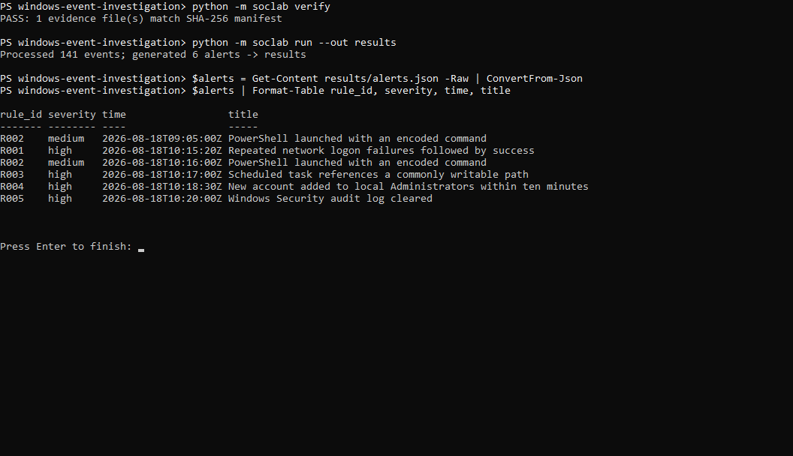
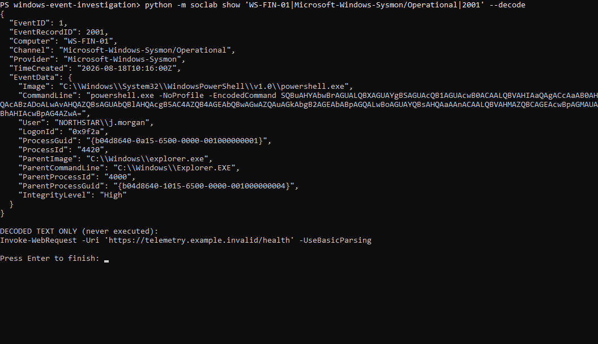
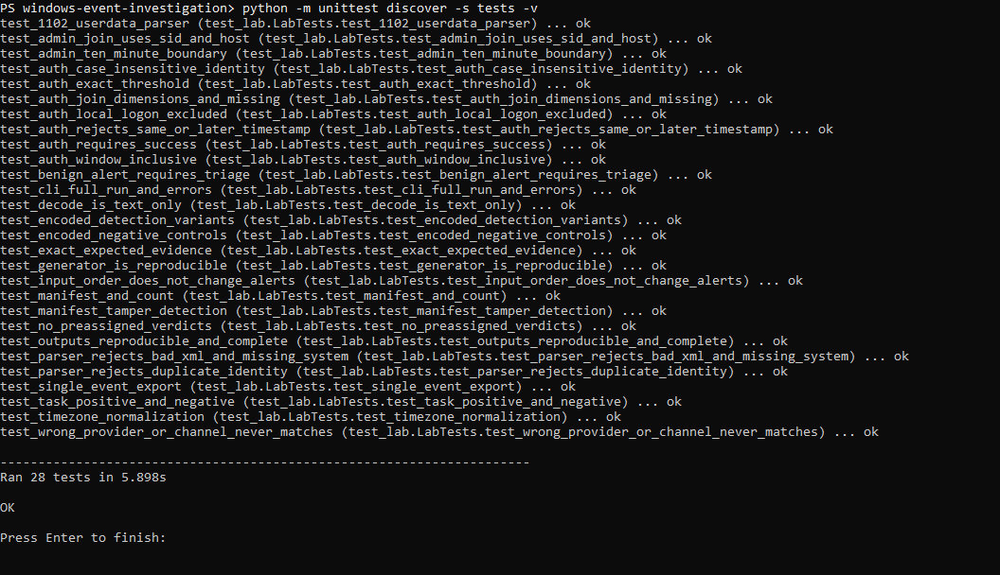

# Windows event log investigation

A small SOC lab built around a suspicious Windows logon. It follows the session through PowerShell, a scheduled task, a new local administrator, and Security log clearing.

The logs are synthetic. The point of the project is to practice reading the evidence, writing detections, and deciding what to escalate. It runs offline with Python 3.10+ and has no external dependencies.

## Running the lab

From this folder:

```powershell
python -m soclab verify
python -m unittest discover -s tests -v
python -m soclab run
```

Use `py -3` on Windows or `python3` on Linux/macOS if that is how Python is installed. No administrator access or Windows VM is required.

The run reads **141 events** and produces **six alerts** from **five rules**. Results go to `results/alerts.json`, `results/timeline.csv`, `results/normalized.jsonl`, and `results/summary.md`. Running it again replaces those result files, leaving the source evidence unchanged.



## What happened

On August 18, 2026, `WS-FIN-01` recorded six failed logons for `NORTHSTAR\j.morgan` from `192.0.2.44`. A successful remote interactive logon followed at 10:15:20 UTC.

The session ID, `0x9f2a`, connects that logon to the later activity. PowerShell launched with an encoded web request, a task was registered to run a script from `C:\Users\Public`, a new local account was added to Administrators, and the Security log was cleared.

That sequence warrants escalation. It does **not** prove data theft or that the scheduled task ran. The [incident report](docs/incident-report.md) covers the evidence, alternative explanations, and proposed response.

## Detections

| Rule | Looks for | Alerts |
|---|---|---:|
| R001 | Five or more failed logons in the five minutes before a matching success | 1 |
| R002 | PowerShell launched with an encoded command | 2 |
| R003 | A scheduled task referencing a commonly writable path | 1 |
| R004 | A newly created account added to local Administrators within ten minutes | 1 |
| R005 | Security audit log clearing | 1 |

One PowerShell alert is an approved inventory job. Its account, parent process, timing, and decoded command match the fictional change record. It remains in the results because the detector should flag the behavior; the analyst decides whether it needs escalation.

The rules are JSON files read by the Python engine. They use a [small custom format](rules/README.md), not Sigma or a SIEM query language.

## Following the evidence

```powershell
python -m soclab show 'WS-FIN-01|Security|1306'
python -m soclab show 'WS-FIN-01|Microsoft-Windows-Sysmon/Operational|2001' --decode
python -m soclab show 'WS-FIN-01|Microsoft-Windows-Sysmon/Operational|2000' --decode
```

`--decode` displays the command as text. It never runs it.



The useful joins are:

- Host, account, domain, and source IP for failed/successful logons.
- Host and logon ID for activity in the same session.
- Host and ProcessGuid for Sysmon process/network events.
- Created account SID and MemberSid for the local group change.

## Tests

The **28 tests pass on Windows with Python 3.12.14**. They check exact evidence matches, threshold and time-window boundaries, missing fields, host separation, benign activity, parsing errors, and the CLI. The saved outputs also match a fresh run byte for byte.



See the [validation notes](docs/validation.md) and [captured test output](sample-output/test-run.txt). A GitHub Actions workflow is included for Windows/Linux with Python 3.10 and 3.12; local testing alone does not verify that matrix.

## Files worth opening

- [Case brief](docs/case-brief.md): environment and approved changes.
- [Investigation worksheet](docs/investigation-guide.md): work through the case before reading the report.
- [Incident report](docs/incident-report.md): findings and escalation.
- [Detection rules](rules/README.md): logic, false positives, and ATT&CK mappings.
- [Sample results](sample-output/summary.md): inspect the output without running Python.
- [Demo walkthrough](docs/interview-demo.md): an eight-minute presentation with commands.

`data/` holds the XML and SHA-256 manifest. `soclab/` contains the parser and detection engine, `tests/` contains the tests, and `scripts/generate_sample.py` rebuilds the fixture.

## Limits and next steps

This is reduced Windows-style XML, not an EVTX capture. It models events retained by a forwarder before the Security log was cleared. Addresses and account names are fictional, and no attack commands are executed.

The dataset is small and selected. These results do not measure production accuracy. The batch correlation engine also needs a different approach for large event volumes. Useful next steps are collecting exports from an authorized Windows VM, adding a failures-only rule, and translating the logic into a SIEM with verified field mappings.

Event definitions and collection assumptions are in the [data dictionary](docs/data-dictionary.md), with links to Microsoft and Sysmon documentation.
